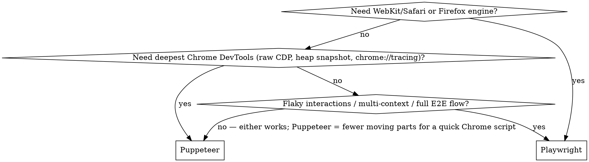

# Browser automation (Puppeteer + Playwright)

Two headless-browser engines on Node. Anything Chrome's DevTools can do is reachable from a script; Playwright adds Firefox + WebKit (Safari engine) and flake-resistant interaction. **Pick per task — see the decision guide.**

## Choosing: Puppeteer vs Playwright



| Dimension | Puppeteer | Playwright |
|---|---|---|
| Browsers | Chrome / Chromium (Firefox experimental) | Chromium, Firefox, **WebKit (Safari engine)** |
| Waiting | manual `waitForSelector` / `waitForFunction` | **auto-waiting** built into every action |
| Selectors | CSS / XPath + `evaluateHandle` | **locators** (`getByRole`/`getByText`/`getByTestId`), auto-retry |
| Isolation | one browser; manual incognito context | first-class **`BrowserContext`** — parallel, isolated, `storageState` reuse |
| Debug tooling | raw CDP, deepest Chrome internals | **`codegen`** (record→code), **trace viewer**, inspector |
| Network | `setRequestInterception` mock/abort | richer **`route()`** + HAR record/replay |
| PDF | Chromium only | Chromium only |
| Footprint | lighter, Chrome-centric | larger, three browsers |

**Default:** new interactive / E2E / cross-browser work → **Playwright** (auto-waiting alone removes most flake). Chrome-DevTools-deep tasks (raw CDP, heap/CPU profiling, `chrome://tracing`), or a quick one-off Chrome script → **Puppeteer**. Pure screenshot / PDF / single-page scrape → either; pick Puppeteer for minimal ceremony, Playwright if you already need a context. **Recommend the choice to the user when it's non-obvious**, citing the deciding factor (e.g. "WebKit needed → Playwright").

## Runtime — detect, install, run

Assume nothing about whether the engines are present. **Detect first, install only if missing, then run correctly** for how they were installed.

### 1. Detect

```bash
node --version                                                   # need an active LTS
npm ls puppeteer playwright 2>/dev/null                          # local to a project?
npm ls -g --depth=0 2>/dev/null | grep -E 'puppeteer|playwright' # installed globally?
```

### 2. Install (only if missing)

```bash
# Project-local — reproducible, no global state; preferred when running inside a project
npm install -D puppeteer playwright

# Global — convenient for ad-hoc standalone scripts not tied to a project
npm install -g puppeteer playwright
```

Browsers usually download during install. If a sandboxed or corporate npm blocks postinstall scripts, fetch the binaries explicitly:

```bash
npx puppeteer browsers install chrome           # Puppeteer's Chrome
npx playwright install chromium firefox webkit  # Playwright browsers (drop names you don't need)
```

### 3. Run a script

```bash
# Project-local install — Node resolves ./node_modules automatically
node script.js

# Global install — Node does NOT search the global node_modules by default; point it there
NODE_PATH=$(npm root -g) node script.js
```

**Using nvm (or any per-version Node manager)?** Global npm installs are kept **per Node version on purpose** — a package installed under one Node version is invisible from another (normal, not a bug), and `npm root -g` resolves per-version too. So select the version you installed the engines under *before* running:

```bash
nvm use --lts            # or the exact version you installed the engines under
NODE_PATH=$(npm root -g) node script.js
```

Browser binary caches (reused across reinstalls of the JS package):
- Puppeteer → `~/.cache/puppeteer/` (`%USERPROFILE%\.cache\puppeteer` on Windows)
- Playwright → `~/.cache/ms-playwright/` (Linux), `~/Library/Caches/ms-playwright/` (macOS), `%USERPROFILE%\AppData\Local\ms-playwright` (Windows)

## Invocation skeletons

```js
// Puppeteer
const puppeteer = require('puppeteer')
;(async () => {
  const browser = await puppeteer.launch({ headless: 'new', args: ['--no-sandbox'] })
  const page = await browser.newPage()
  // ... your work ...
  await browser.close()
})()
```

```js
// Playwright — swap chromium for firefox / webkit to change engine
const { chromium } = require('playwright')
;(async () => {
  const browser = await chromium.launch()                       // headless by default
  const context = await browser.newContext({ viewport: { width: 1280, height: 800 } })
  const page = await context.newPage()
  await page.goto('https://example.com')                        // auto-waits for load
  // ... your work ...
  await browser.close()
})()
```

---

## Puppeteer patterns

### Interaction — click a text-matched button

```js
const findBtn = (text) => page.evaluateHandle((t) => {
  return Array.from(document.querySelectorAll('button')).find(
    (b) => b.textContent?.trim() === t && b.offsetParent !== null
  ) || null
}, text)

const btn = (await findBtn('Load more')).asElement()
if (btn) await btn.click()
```

### Network — intercept POST + dump headers / response

```js
page.on('response', async (res) => {
  if (res.request().method() !== 'POST') return
  const body = await res.text()
  console.log({
    url: res.url(),
    status: res.status(),
    reqHeaders: res.request().headers(),
    bodyHead: body.slice(0, 500),
  })
})
```

### Network — mock / abort / modify a request

```js
await page.setRequestInterception(true)
page.on('request', (req) => {
  if (req.url().includes('/api/items')) {
    return req.respond({ status: 200, contentType: 'application/json', body: '[]' })
  }
  if (req.url().includes('analytics')) {
    return req.abort()
  }
  req.continue()
})
```

### Debug — console / errors / failed requests

```js
page.on('console', (msg) => console.log(`[browser:${msg.type()}]`, msg.text()))
page.on('pageerror', (err) => console.log('[browser:uncaught]', err.message, err.stack))
page.on('requestfailed', (req) => console.log('[browser:req-failed]', req.url(), req.failure()?.errorText))
page.on('dialog', async (dialog) => { console.log('[browser:dialog]', dialog.type(), dialog.message()); await dialog.dismiss() })
```

### Inspect DOM at any point

```js
const data = await page.evaluate(() => ({
  url: location.href,
  title: document.title,
  items: document.querySelectorAll('.item').length,
  metaDescription: document.querySelector('meta[name="description"]')?.content,
  headerColor: getComputedStyle(document.querySelector('header')).color,
}))
```

### Visual — screenshot / PDF

```js
await page.screenshot({ path: 'page.png', fullPage: true })
await page.screenshot({ path: 'elem.png', clip: await (await page.$('.hero')).boundingBox() })
await page.pdf({ path: 'page.pdf', format: 'A4' })
```

### Emulation — device / geolocation / cookies

```js
await page.emulate(puppeteer.KnownDevices['iPhone 13'])
await page.setGeolocation({ latitude: 37.7749, longitude: -122.4194 })
await page.setCookie({ name: 'session', value: '...', domain: 'example.com' })
```

### Performance — coverage / metrics / tracing

```js
// JS coverage — find unused code
await page.coverage.startJSCoverage()
await page.goto('https://example.com')
const cov = await page.coverage.stopJSCoverage()
cov.forEach(e => console.log(e.url, e.ranges.length))

// performance metrics snapshot
const m = await page.metrics()
console.log({ Frames: m.Frames, JSHeapUsedSize: m.JSHeapUsedSize, ScriptDuration: m.ScriptDuration })

// full performance trace (DevTools timeline JSON, openable in chrome://tracing)
await page.tracing.start({ path: 'trace.json' })
await page.goto('https://example.com', { waitUntil: 'networkidle2' })
await page.tracing.stop()
```

### Raw DevTools Protocol (anything the high-level API doesn't expose)

```js
const cdp = await page.target().createCDPSession()
await cdp.send('Network.enable')
cdp.on('Network.responseReceived', (e) => console.log(e.response.status, e.response.url))

// e.g. heap snapshot, control service workers, profile CPU, fetch security state
await cdp.send('HeapProfiler.takeHeapSnapshot')
```

---

## Playwright patterns (the differences that matter)

Network observation, screenshots (`page.screenshot`), `page.pdf` (Chromium only), `page.evaluate`, and `page.emulate`-style options all have direct equivalents — the API shapes are close. What you reach for Playwright *for* is below.

### Locators + auto-waiting (kills most flake)

```js
// Locators auto-wait AND auto-retry until actionable — no manual waitForSelector.
await page.getByRole('button', { name: 'Load more' }).click()
await page.getByLabel('Email').fill('a@b.com')
await page.getByText('Welcome back').waitFor()          // explicit wait when you need it
// Web-first assertions (retry until true) live in the test runner package:
//   npm install -g @playwright/test
//   const { expect } = require('@playwright/test')
//   await expect(page.getByText('Welcome')).toBeVisible()
```

### Cross-browser — the thing Puppeteer can't do

```js
const { chromium, firefox, webkit } = require('playwright')
for (const engine of [chromium, firefox, webkit]) {       // webkit = Safari's engine
  const browser = await engine.launch()
  const page = await browser.newPage()
  await page.goto('https://example.com')
  console.log(browser.version(), await page.title())
  await browser.close()
}
```

### Isolated contexts + saved auth state

```js
const ctx = await browser.newContext({ storageState: 'auth.json' })   // reuse a logged-in session
// ... do work ...
await ctx.storageState({ path: 'auth.json' })                         // persist cookies + localStorage
// Each context is fully isolated — run several in parallel for multi-account / multi-tab flows.
```

### Network — route / mock / HAR

```js
await page.route('**/api/items', route => route.fulfill({ status: 200, body: '[]' }))
await page.route('**/analytics/**', route => route.abort())
// Record once, replay offline: newContext({ recordHar: { path: 'net.har' } }) → routeFromHAR('net.har')
```

### Debug tooling Puppeteer lacks

```bash
playwright codegen https://example.com      # click around → generates Playwright script
playwright show-trace trace.zip             # open the trace viewer (DOM snapshots + timeline per step)
PWDEBUG=1 node script.js                     # step through with the Playwright Inspector
```
```js
// Programmatic trace (base package — no test runner needed):
await context.tracing.start({ screenshots: true, snapshots: true })
// ... actions ...
await context.tracing.stop({ path: 'trace.zip' })   // view with: playwright show-trace trace.zip
```

## Wait strategies — pick the right one

```js
// Puppeteer
await page.goto(url, { waitUntil: 'networkidle2' })             // 0 inflight reqs for 500ms
await page.waitForSelector('.results', { timeout: 10000 })
await page.waitForSelector('.spinner', { hidden: true })
await page.waitForFunction(() => window.__APP_READY__ === true, { timeout: 5000 })
await page.waitForResponse(res => res.url().includes('/api/data') && res.status() === 200)

// Playwright — most actions auto-wait, so explicit waits are rarely needed
await page.goto(url, { waitUntil: 'networkidle' })
await page.locator('.results').waitFor()                        // visible by default
await page.locator('.spinner').waitFor({ state: 'hidden' })
await page.waitForFunction(() => window.__APP_READY__ === true)
await page.waitForResponse(res => res.url().includes('/api/data') && res.ok())
```

## Troubleshooting

- `Cannot find module 'puppeteer'` / `'playwright'` → not installed for the Node you're running. Check with `npm ls puppeteer playwright` (add `-g` for a global install); reinstall on that Node if missing.
- Puppeteer `Failed to launch the browser process` → Chrome not downloaded (some sandboxed/corporate npm setups block postinstall scripts). `npx puppeteer browsers install chrome`.
- Playwright `Executable doesn't exist … ms-playwright` → browsers not installed for this Playwright version. `playwright install chromium firefox webkit`.
- Sandbox launch error (Linux/Docker/CI/root, or a macOS sandbox prompt) → `args: ['--no-sandbox']`.
- Chromium fails on some sites with `ERR_HTTP2_PROTOCOL_ERROR` (TLS/H2 fingerprinting) → retry with Playwright **firefox** or **webkit**.
- Need to SEE the browser → Puppeteer `headless: false, devtools: true`; Playwright `chromium.launch({ headless: false })` or `PWDEBUG=1`.
- Interactive pause → Puppeteer `await page.pause()` (needs `headless:false`); Playwright `await page.pause()` (opens Inspector).

## When NOT to reach for this

- Server-side only logic — curl + scripted requests is faster.
- Static content checks — `curl + grep` is enough.
- Anything where the request layer alone reveals the answer (status / headers / body inspection without JS).

Use the browser when the bug specifically lives in the **browser-side runtime** — JS execution, DOM rendering, client-side state, or user interaction.
